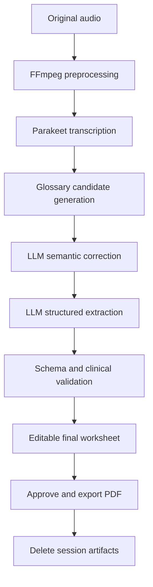
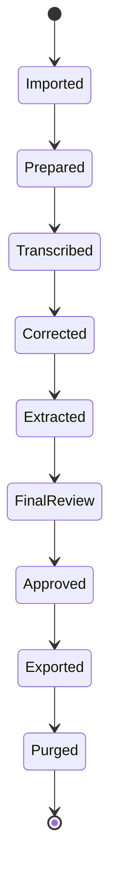

# Ophthalmology Dictation Assistant

## 1. Purpose

This project is a fully local Windows application that converts an ophthalmologist's prerecorded dictation into the specific A4 ocular-health worksheet supplied for this project.

The application is a worksheet-filling assistant, not a general clinical-note system and not a diagnostic or treatment decision system. The original audio is the evidentiary source, the glossary-corrected transcript is an intermediate operational artifact, and the ophthalmologist is the final authority. The only mandatory human review is the completed worksheet preview immediately before export.

## 2. MVP scope

### Included

- Windows desktop application built with Electron and TypeScript.
- Import of prerecorded WAV, MP3, M4A, and FLAC audio.
- Local audio decoding and canonical format conversion using FFmpeg.
- Local English speech recognition using NVIDIA Parakeet.
- Support for Indian-accented English through in-domain testing and glossary-assisted correction.
- Ophthalmology glossary containing canonical terms, aliases, short descriptions, and form-field context.
- A terminology-cleanup LLM call through llama.cpp.
- A separate structured-extraction LLM call through llama.cpp.
- Strict JSON Schema and application-level validation.
- A single final clinician review screen containing an editable rendering of the completed worksheet.
- A clean A4 vector recreation of the supplied ocular-health form.
- Local PDF generation of that worksheet only.

### Excluded from the MVP

- Live microphone recording.
- Multiple speakers and speaker diarization.
- Hindi or other Indian-language dictation.
- EMR/EHR integration.
- Cloud APIs or remote model inference.
- Automatic diagnosis or clinical recommendations.
- Freehand drawing on the eye diagrams.
- Multi-user accounts, synchronization, or central patient storage.
- Patient demographics, patient identifiers, encounter identifiers, or clinician identity management.
- General-purpose ophthalmology notes or fields not present on the supplied worksheet.
- Persistent case history, reopening completed cases, or long-term transcript/audio storage.
- Export of intermediate transcripts or internal JSON as clinical records.
- Model fine-tuning.
- DOCX generation.

### Fixed worksheet boundary

The schema and renderer may contain only the following visible areas from the supplied form. Exact abbreviations and local conventions remain subject to Phase 0 clinician sign-off.

| Worksheet area | Visible content in scope |
| --- | --- |
| OD and OS anterior | Lids/Lashes, Conjunctiva, Sclera, Angles 1-4, Cornea, Iris/Pupil, A/C, Lens/Media, WNL/PATH, and the printed anterior diagrams/labels |
| OD and OS posterior | Media, C/D notation, Shape/Type, Rim Tissue, VP, Post. Pole, A/V, ALR 1-3, Macula/FLR, Periphery, WNL/PATH, and 20D/78D/Direct choices |
| Assessment | The printed multiline assessment area |
| Glasses Rx | DV/NV/INT/Other, OD, OS, Prism, and Add fields in both printed blocks |
| Contacts Rx | Loaner/Trial/Final, OD, OS, BC, Diam, Brand/Type, WT, Color, Solution, Enzyme Y/N, Dispensed/Order/Amount, and Additional Instructions |
| Additional Testing | Topography, Cycloplegia, Tonometry, Fields, Retinal Photo, CL Check, Med. Follow, Exam, Correspondence, and Copy Chart with their printed choices |
| Recommendations | Hi-index/Asph., ARC, ST Bifocal, UV 400, Progressive, and Polycarb |
| Signature line | Preserve the printed O.D. line, but do not auto-populate clinician identity in the MVP |

The eye diagrams are reproduced visually but are not populated or annotated by the MVP. Any dictated content outside this boundary becomes an unmapped final-screen warning rather than a new schema field.

## 3. Confirmed deployment assumptions

| Item | Decision |
| --- | --- |
| Target computer | Acer Helios 300; exact CPU, RAM, GPU, and VRAM still to be measured |
| Operating system | Windows 10 or Windows 11, 64-bit |
| Dictation language | Indian-accented English |
| Processing | Fully local and offline after installation |
| Input | Prerecorded audio for the MVP |
| Output | The supplied ocular-health worksheet as an A4 portrait PDF |
| Identity data | No patient PII is accepted or generated |
| Review | One editable final-worksheet review and approval step |
| Retention | Delete the temporary session after successful PDF export; retain only the user-selected PDF |
| ASR | Parakeet through NeMo-Speech.cpp |
| LLM runtime | llama.cpp server |
| LLM size | 7-9B instruct GGUF baseline; 4B fallback for constrained hardware |

## 4. Architectural principles

1. **Audio is the evidentiary source.** ASR output is a fallible hypothesis.
2. **The corrected transcript is traceable internally.** Every terminology replacement records the original phrase, replacement, timestamp, glossary entry, evidence type, and reason. LLM self-confidence is not used as a safety signal.
3. **Clinical extraction is constrained.** The LLM must emit schema-valid JSON and may not invent missing findings.
4. **Worksheet-critical facts receive special protection.** Laterality, negation, measurements, prescription values, and printed worksheet choices cannot be silently rewritten when ambiguous.
5. **Ambiguity is surfaced at final review.** Conflicts and unmapped dictation appear as warnings on the completed worksheet screen; there is no separate correction-approval workflow.
6. **The clinician approves the final worksheet.** Export is blocked until the clinician verifies the completed worksheet as a whole.
7. **The application works offline.** Runtime services bind only to the loopback interface.
8. **Models are replaceable.** ASR and LLM implementations sit behind provider interfaces.
9. **Deterministic software handles deterministic work.** Validation, form mapping, and PDF rendering are performed in TypeScript, not by an LLM.
10. **Sessions are ephemeral.** No database or case history is created. Working audio, transcripts, JSON, and previews are deleted after successful export and abandoned sessions are cleaned on startup.

## 5. System context



## 6. Runtime components

| Component | Responsibility | MVP technology |
| --- | --- | --- |
| Electron renderer | Import workflow, progress, final worksheet editing, warnings, approval, and PDF preview | React, TypeScript, Vite |
| Electron main process | Orchestration, local process lifecycle, filesystem access, secure IPC | Electron, TypeScript |
| Audio processor | Decode, resample, and create canonical audio; optional evaluated filter profiles | Bundled FFmpeg |
| ASR provider | Produce transcript, segments, and timestamps | NeMo-Speech.cpp with Parakeet TDT 0.6B v3 Q8_0 |
| Candidate generator | Find glossary terms that may explain suspicious ASR phrases | TypeScript fuzzy and phonetic matching |
| Cleanup service | Correct semantically implausible medical terms using glossary candidates | llama.cpp OpenAI-compatible API |
| Extraction service | Convert corrected transcript into form JSON | llama.cpp with JSON Schema constraints |
| Validation service | Validate structure and clinical invariants | Zod plus deterministic rules |
| PDF service | Map approved values to the vector A4 form | `pdf-lib` |
| Session store | Retain intermediate artifacts only until export or abandonment cleanup | Randomly named temporary session directory |

## 7. Process boundaries and security

### Electron

- Keep `contextIsolation` enabled.
- Keep `nodeIntegration` disabled in the renderer.
- Expose only narrow, typed operations through the preload bridge.
- Perform filesystem access and process spawning in the main process.
- Validate every IPC request with Zod.
- Do not render untrusted transcript text as HTML.

### Local inference services

- Bind NeMo-Speech.cpp and llama.cpp only to `127.0.0.1`.
- Use dynamically assigned local ports where practical.
- Generate a per-launch local API token if the selected server supports it.
- Start services from the Electron main process and terminate owned processes on application exit.
- Verify binary and model checksums through a packaged manifest.
- Capture model identifiers, quantization, application version, and glossary version in ephemeral session metadata.

### Data handling and privacy

- The MVP accepts no patient name, date of birth, address, phone number, clinic identifier, encounter identifier, or other PII.
- Dictation guidance must instruct the clinician not to speak identifying information. A lightweight on-device warning may detect common identifier patterns, but it is not a guarantee of de-identification.
- Never write audio, transcript text, worksheet values, prompts, filenames, or source paths to console, crash, telemetry, or diagnostic logs.
- Copy the selected input into a randomly named private session directory. The user-selected source file remains outside application control and is never modified.
- Store prepared audio, raw transcript, corrected transcript, extraction JSON, worksheet state, and preview PDF only inside that session directory.
- Do not provide an MVP option to retain a working session, transcript, audio copy, or JSON sidecar.
- After the approved PDF has been written successfully, delete the entire session directory. On cancellation or application exit, offer discard; on startup, remove abandoned session directories.
- Deletion is best-effort filesystem cleanup and must not be described as forensic secure erasure, especially on SSDs.
- Persist only non-clinical application settings; protect any sensitive setting with Windows DPAPI through Electron `safeStorage`.

## 8. Processing pipeline

### 8.1 Case import

The clinician selects an audio file that contains no PII. The application creates a random session ID and copies the input into a temporary session directory. The original file remains unchanged and is not deleted by the application.

Supported MVP formats:

- WAV
- MP3
- M4A/AAC
- FLAC

### 8.2 Audio preprocessing

Create a canonical 16 kHz, mono, signed 16-bit PCM WAV file. Conversion-only is the initial default:

```bash
ffmpeg -i input.m4a -ac 1 -ar 16000 -c:a pcm_s16le \
  prepared.wav
```

Filtering and denoising are disabled by default because they can remove quiet consonants and worsen medical-term recognition. Versioned high-pass, loudness-normalization, and denoising profiles may be added only after evaluation on the intended clinician's recordings shows an improvement in critical-term recovery.

### 8.3 Speech recognition

The default provider uses Parakeet TDT 0.6B v3 through NeMo-Speech.cpp. It returns:

- Full raw transcript.
- Segment timestamps.
- Word timestamps when available.
- Runtime and model metadata.

The provider contract must permit later comparison with Parakeet v2 and Whisper large-v3-turbo without changing downstream stages.

```ts
export interface AsrProvider {
  transcribe(audioPath: string): Promise<AsrResult>;
}

export interface AsrResult {
  text: string;
  segments: Array<{
    startSeconds: number;
    endSeconds: number;
    text: string;
  }>;
  model: string;
  durationMs: number;
}
```

### 8.4 Glossary candidate generation

Before invoking the cleanup LLM, deterministic code identifies suspicious spans and proposes a small set of glossary candidates. Candidate ranking may use:

- Normalized edit distance.
- Token overlap.
- Phonetic similarity.
- Abbreviation matching.
- Known ASR confusion aliases.
- Expected anatomical category and form field.
- Clinician-approved aliases from the versioned glossary and offline evaluation corpus; runtime sessions never update the glossary.

The LLM receives only the relevant glossary entries rather than the entire glossary.

### 8.5 Glossary-aware semantic cleanup

The cleanup call receives:

- Raw transcript and timestamps.
- Candidate glossary entries.
- Nearby transcript context.
- Explicit correction rules.
- A JSON output schema.

The LLM may replace a phrase when the original is medically implausible, the replacement is phonetically credible, and the surrounding anatomical context supports it.

The cleanup output is structured:

```json
{
  "correctedTranscript": "OD shows a posterior subcapsular cataract.",
  "corrections": [
    {
      "rawText": "posterior capsular category",
      "correctedText": "posterior subcapsular cataract",
      "glossaryId": "posterior_subcapsular_cataract",
      "timestampStart": 18.4,
      "timestampEnd": 20.1,
      "reason": "Phonetically similar and consistent with a lens finding.",
      "candidateSource": ["known_asr_confusion", "phonetic", "field_context"],
      "deterministicCandidateRank": 1,
      "protectedContentTouched": false
    }
  ],
  "unresolvedSegments": []
}
```

#### Protected content

The cleanup stage must not silently alter:

- OD, OS, OU, right, left, or bilateral.
- Negations such as no, not, absent, negative, or without.
- Numeric measurements.
- Measurements and ratios printed on the worksheet.
- Glasses and contact-lens prescription values.
- Printed worksheet choices and test selections.

When protected content is uncertain, the cleanup result retains the original phrase, records possible alternatives, and emits a blocking warning for the final worksheet screen. It does not require a separate correction-approval screen. An ambiguous protected value is left blank or unresolved during extraction until the clinician resolves it on the final worksheet.

### 8.6 Structured extraction

The extraction call receives the corrected transcript, raw transcript, correction record, glossary identifiers, and the form schema. The corrected transcript is the primary operational input; the remaining artifacts provide provenance.

Recommended llama.cpp settings:

- Context: 8K.
- Temperature: 0.
- Reasoning/thinking: disabled.
- Schema-constrained response format.
- Short maximum output appropriate to the form schema.
- Missing observations represented explicitly as `not_mentioned`, never automatically by `WNL` or normal.

Simplified logical structure:

```json
{
  "ocularHealth": {
    "od": {
      "anterior": {
        "cornea": {"status": "not_mentioned", "value": null, "sourceSegmentIds": []}
      },
      "posterior": {}
    },
    "os": {
      "anterior": {},
      "posterior": {}
    }
  },
  "assessment": [],
  "plan": {
    "glassesRx": null,
    "contactsRx": null,
    "additionalTesting": [],
    "additionalInstructions": [],
    "recommendations": []
  },
  "unmappedStatements": [],
  "warnings": []
}
```

Statements that cannot be represented by the schema must appear in `unmappedStatements`; they must not be discarded.

Observation status values are `not_mentioned`, `not_examined`, `unable_to_assess`, `observed_normal`, `observed_abnormal`, and `not_applicable`. The PDF may render several statuses as blank, but the final review UI preserves the distinction. The model may output only `not_mentioned`, `observed_normal`, or `observed_abnormal` when supported by dictation; the clinician may select any status during final editing.

### 8.7 Deterministic validation

Validation occurs after extraction and again after clinician editing.

Validation rules include:

- JSON conforms to the versioned Zod schema.
- Laterality is present where required and does not conflict with the transcript.
- Numeric fields use permitted formats and ranges.
- Mutually exclusive selections are not simultaneously set.
- Protected content changed during cleanup is always flagged.
- Every populated field links to a transcript span or explicit clinician edit.
- Unmapped statements and unresolved segments are summarized as warnings on the final worksheet screen.
- Export approval is blocked while required-review items remain unresolved.

### 8.8 Clinician review

The MVP has one human review step. The final review screen contains:

- An editable worksheet laid out like the exported A4 form.
- Clear OD/OS separation and the form's printed choices.
- Field highlighting for laterality conflicts, numeric conflicts, contradictory values, missing provenance, overflow, unresolved spans, and unmapped dictation.
- A compact warning list linked to the affected worksheet fields.
- Optional source-audio replay for a highlighted field without opening a separate approval workflow.
- A PDF preview generated from the current worksheet state.
- One explicit `Worksheet verified — export PDF` control.

Editing a field reruns deterministic validation and refreshes the preview. The clinician verifies the worksheet as a whole; individual LLM corrections are not separately accepted or rejected.

### 8.9 PDF generation

The MVP generates an A4 portrait PDF using a vector template. The PDF page size is 595.28 by 841.89 points.

The template recreates:

- OD and OS anterior findings.
- OD and OS posterior findings.
- Assessment.
- Plan.
- Glasses prescription.
- Contact-lens prescription.
- Additional testing.
- Additional instructions.
- Recommendations.

Eye diagrams remain present but non-interactive in the MVP. Findings are entered in their adjacent textual fields.

Form locations are stored using normalized coordinates and converted to PDF points at render time:

```ts
export const fieldMap = {
  "ocularHealth.od.anterior.cornea": {
    x: 0.085,
    y: 0.782,
    width: 0.155,
    height: 0.018
  }
};
```

Text overflow is handled deterministically through wrapping, maximum line counts, and minimum font-size rules. Because the MVP output is specifically this one-page form, a field that still overflows is flagged and must be shortened by the clinician before export; no continuation page is generated.

## 9. Glossary design

The glossary is versioned JSON or YAML and is maintained separately from application code.

```json
{
  "id": "posterior_subcapsular_cataract",
  "canonicalTerm": "posterior subcapsular cataract",
  "abbreviation": "PSC",
  "aliases": [
    "posterior subcapsular opacity",
    "post subcapsular cataract"
  ],
  "asrConfusions": [
    "posterior capsular category"
  ],
  "description": "A lens opacity located immediately anterior to the posterior lens capsule.",
  "category": "lens",
  "expectedFields": [
    "ocularHealth.od.anterior.lensMedia",
    "ocularHealth.os.anterior.lensMedia"
  ],
  "confusableWith": [
    "posterior_capsular_opacification"
  ]
}
```

Each entry should contain:

- Stable ID.
- Canonical term.
- Common abbreviation.
- Spoken aliases.
- Known ASR mistakes.
- One-line description.
- Anatomical category.
- Expected form fields.
- Confusable terms.
- Optional valid units or values.

Glossary changes increment a version and are recorded in ephemeral session metadata and release/evaluation manifests. The glossary contains no patient-derived context.

## 10. Ephemeral session data and state machine

Each run is an isolated temporary bundle:

```text
session-<random-id>/
  metadata.json
  original-audio.<ext>
  prepared.wav
  asr.json
  cleanup.json
  extraction.json
  worksheet.json
  preview.pdf
```

The workflow uses explicit states:



Each stage writes a complete result atomically, permitting retry during the active session. Completed sessions are not reopenable: successful export triggers purge, and abandoned sessions are deleted at startup.

## 11. Hardware adaptation

The Helios 300 family spans several hardware generations. At first launch, the application records CPU model, system RAM, GPU model, and available VRAM, then chooses a profile.

| Detected VRAM | Default profile |
| ---: | --- |
| 12 GB or more | Sequential GPU execution; Parakeet followed by 9B Q6 LLM |
| 8 GB | Sequential GPU execution; 9B Q4_K_M LLM |
| 6 GB | Parakeet on CPU or sequential GPU; 7-9B Q4 with partial offload |
| 4 GB | Parakeet on CPU; 4B Q4_K_M LLM |
| No supported GPU | CPU execution for both stages with a visible latency warning |

The MVP uses sequential model execution: load Parakeet, transcribe, release its resources, verify VRAM availability, then start llama.cpp for cleanup and extraction. Concurrent residency is post-MVP and only after hardware measurement.

## 12. Proposed repository structure

```text
ophthalmology-dictation/
  apps/
    desktop/
      src/main/
      src/preload/
      src/renderer/
  packages/
    pipeline/
    schemas/
    glossary/
    pdf-template/
    shared/
  resources/
    bin/
      ffmpeg/
      nemo-speech/
      llama.cpp/
    models/
    templates/
  fixtures/
    synthetic/
    deidentified/
  tests/
    unit/
    integration/
    golden/
  architecture.md
```

Large model files should not be committed to Git. A versioned manifest records approved model names, hashes, download locations, licenses, and expected sizes.

## 13. Error handling

| Failure | Application behavior |
| --- | --- |
| Unsupported or corrupt audio | Stop before inference and display a conversion error |
| FFmpeg failure | Preserve the user-selected source audio and show a diagnostic code without logging clinical content or paths |
| ASR service unavailable | Restart once, then show a recoverable error |
| Invalid cleanup JSON | Retry once with the same schema; otherwise require manual transcription |
| Invalid extraction JSON | Retry once; never attempt to repair clinical values heuristically |
| Laterality or negation ambiguity | Block approval until clinician resolves it |
| Text overflow in PDF | Highlight field and require edit before export |
| Insufficient VRAM | Restart with a lower hardware profile or CPU fallback |
| Application interruption | Resume only from the active temporary session when recoverable; otherwise offer discard and purge it |
| Session cleanup failure | Warn locally, retry on next startup, and never claim secure erasure |

## 14. Quality and evaluation strategy

Build a de-identified test corpus of at least 30 real dictations from the intended ophthalmologist. Include:

- Normal and abnormal findings.
- OD, OS, and OU statements.
- Self-corrections.
- Indian-accented medical terminology.
- Worksheet measurements, prescription values, and printed choices.
- Abbreviations.
- Negations.
- Moderate background noise.
- Similar and confusable ophthalmology terms.

Compare at minimum:

1. Parakeet v3 raw output.
2. Parakeet v3 plus glossary-aware cleanup.
3. Whisper large-v3-turbo raw output.
4. Whisper large-v3-turbo plus the same cleanup stage.
5. Parakeet v2 if its Windows deployment cost remains acceptable.

Primary metrics:

- Critical medical-term recovery rate.
- Laterality accuracy.
- Negation accuracy.
- Numeric-value accuracy.
- Field-level precision, recall, and exact match.
- Unsupported assertion rate.
- Final worksheet edit count, warning count, and total review time.
- End-to-end latency.

Ordinary word-error rate is recorded but is not the primary release criterion.

## 15. Phased MVP development plan

Estimates below are engineering days for one developer and exclude delays in collecting clinician recordings or approving the glossary.

### Phase 0: Clinical contract and fixtures — 2 to 3 days

**Objective:** Remove ambiguity from the form and clinical vocabulary before building inference logic.

Tasks:

- Review every field and abbreviation in the supplied form with the ophthalmologist.
- Define the canonical structured-data schema.
- Mark worksheet-protected content: laterality, negation, numbers, prescription values, and printed choices.
- Define explicit observation statuses and their PDF rendering.
- Approve a structured dictation sequence aligned with this worksheet.
- Create the first glossary with approximately 100-200 high-frequency terms.
- Obtain 10-15 de-identified recordings for early development.
- Create manually approved transcripts and expected JSON for five golden cases.

Deliverables:

- `ocular-exam.schema.json`.
- `ophthalmology-glossary.v1.json`.
- Field-to-PDF mapping specification.
- Five golden test fixtures.

Exit criteria:

- Ophthalmologist approves field meanings and glossary structure.
- Every visible form field has a type, explicit observation-state behavior, and render rule.
- Golden cases include OD, OS, numbers, negation, and at least one ASR-confusable term.

### Phase 1: Electron shell and hardware probe — 2 to 3 days

**Objective:** Establish a secure Windows application skeleton and determine the Helios 300 execution profile.

Tasks:

- Scaffold Electron, React, Vite, and TypeScript.
- Implement secure preload IPC.
- Add audio-file import and ephemeral session creation.
- Detect CPU, RAM, GPU, VRAM, and available disk space.
- Add local process supervision and health checks.
- Define the session state machine, atomic artifact writes, and purge behavior.
- Build a fixture-driven walking skeleton from fake transcript through editable worksheet, preview, export, and cleanup.

Deliverables:

- Installable development build.
- Hardware report screen.
- Ephemeral session workspace and typed IPC contracts.

Exit criteria:

- Application imports an audio file without renderer filesystem access.
- Hardware profile is correctly selected on the Helios 300.
- The fixture-driven worksheet preview/export path works before real model integration.

### Phase 2: Audio-to-transcript vertical slice — 3 to 4 days

**Objective:** Produce a timestamped Parakeet transcript from a prerecorded file entirely offline.

Tasks:

- Bundle or install FFmpeg and NeMo-Speech.cpp.
- Implement canonical audio conversion.
- Integrate Parakeet v3 Q8_0.
- Persist raw transcript, timestamps, model version, and runtime duration.
- Add internal transcript inspection for development and optional field-level audio replay from the final screen.
- Test CPU and GPU execution profiles.

Deliverables:

- Working audio-to-transcript path.
- ASR provider interface.
- Conversion and ASR integration tests.

Exit criteria:

- All supported input formats produce a playable canonical WAV.
- Parakeet runs without an internet connection.
- Transcript timestamps seek to the correct audio region.
- Failures leave the original audio intact and can be retried.

### Phase 3: Glossary-aware correction — 4 to 5 days

**Objective:** Recover ophthalmology terms that ASR renders incorrectly while keeping corrections internally traceable and surfacing only final worksheet risks to the clinician.

Tasks:

- Implement glossary loader and versioning.
- Implement fuzzy, alias, and phonetic candidate generation.
- Start llama.cpp with the selected GGUF model.
- Create the constrained cleanup prompt and JSON schema.
- Record raw-to-corrected differences and source segment IDs internally.
- Enforce protected-content rules.
- Generate de-identified confusion-alias proposals for later glossary review; do not learn automatically from a session.

Deliverables:

- Candidate generator.
- Structured cleanup result.
- Cleanup trace artifact and final-screen warning adapter.
- Golden tests for known medical-term confusions.

Exit criteria:

- Every change is linked to immutable segment IDs, audio time, glossary ID, candidate evidence, and deterministic rank.
- No protected value is silently changed in the golden set.
- Uncertain corrections become field warnings or unresolved values on the single final worksheet screen.
- Glossary cleanup improves medical-term recovery over raw Parakeet output.

### Phase 4: Extraction, validation, and final worksheet review — 4 to 5 days

**Objective:** Convert the corrected transcript into editable form data without losing unsupported statements.

Tasks:

- Implement the schema-constrained extraction call.
- Build the Zod schema and clinical validation rules.
- Map fields to transcript provenance.
- Build the grouped editor to visually match the final worksheet.
- Add field-linked warnings, unresolved spans, and unmapped statements to the same final screen.
- Require one explicit clinician approval for the completed worksheet.

Deliverables:

- Versioned extraction schema.
- Structured-extraction service.
- Final worksheet review screen.
- Validation test suite.

Exit criteria:

- Extraction output is schema-valid for every golden case.
- Missing observations remain `not_mentioned` rather than becoming normal findings.
- Unmapped statements are never silently dropped.
- Approval is impossible while required-review issues remain unresolved.

### Phase 5: A4 PDF generation — 3 to 4 days

**Objective:** Produce a clean, legible and repeatable A4 version of the supplied ocular-health form.

Tasks:

- Recreate the form as an A4 vector template.
- Implement normalized field coordinates.
- Map the approved ephemeral worksheet state to text and selection marks.
- Add wrapping, font-size, and overflow rules.
- Add PDF preview and export.
- Purge preview and intermediate artifacts after the PDF is successfully exported.
- Create PDF visual-regression fixtures.

Deliverables:

- A4 template.
- PDF renderer and preview.
- Field-coordinate map.
- Visual-regression reference files.

Exit criteria:

- Every supported field appears in its intended location.
- No text is clipped or rendered outside its field.
- The exported PDF matches the approved worksheet state.
- The ophthalmologist approves the template's legibility and organization.

### Phase 6: In-domain evaluation and Windows packaging — 5 to 7 days

**Objective:** Turn the vertical slice into a testable MVP installer and choose the best ASR configuration for the intended speaker.

Tasks:

- Expand the corpus to at least 30 de-identified recordings.
- Compare Parakeet and Whisper variants using identical downstream processing.
- Measure critical-term, laterality, negation, number, and field accuracy.
- Tune glossary entries and prompts only against a development split.
- Run the final evaluation on a held-out split.
- Add mandatory post-export cleanup, startup orphan cleanup, and diagnostics containing no clinical content.
- Package signed or test-signed Windows installation artifacts.
- Test installation, upgrade, offline startup, and clean uninstallation.

Deliverables:

- Evaluation report.
- Selected ASR and LLM configuration.
- Windows installer.
- User acceptance checklist.

Exit criteria:

- Zero silent laterality, negation, or numeric changes in the held-out MVP set.
- One hundred percent schema-valid extraction.
- At least 90% exact recovery of populated clinical fields on the held-out set, with remaining errors visible during review.
- Every exported worksheet is explicitly clinician-approved.
- A typical case completes within the latency target agreed after Helios 300 benchmarking.
- The entire workflow functions with networking disabled.

## 16. MVP completion definition

The MVP is complete when an ophthalmologist can:

1. Install and launch the application on the Acer Helios 300.
2. Import a prerecorded English dictation.
3. Obtain a timestamped Parakeet transcript locally.
4. Wait while glossary-assisted correction and worksheet extraction run automatically.
5. Review and edit the completed worksheet once.
6. Resolve every blocking warning on that final screen.
7. Approve and export the A4 PDF.
8. Have all application working data deleted, leaving only the selected PDF and the original source audio outside the application.

## 17. Post-MVP roadmap

- Live microphone capture and streaming transcription.
- Custom voice activity detection and endpointing.
- Personalized pronunciation and confusion lexicon.
- Optional second-ASR arbitration for uncertain or disagreeing spans.
- Interactive annotations on the eye diagrams.
- DOCX output.
- Optional encrypted longitudinal case storage only if the product scope later changes.
- EMR integration.
- Additional ophthalmology forms.
- Controlled model adaptation using clinician-approved, de-identified data.

## 18. Open decisions

1. Exact Helios 300 CPU, RAM, GPU, and VRAM.
2. Final set of fields and meanings of form-specific abbreviations.
3. Clinician-approved rendering for each explicit observation status.
4. Final vector layout and exact interpretation of every printed choice.
5. Clinician-approved latency and accuracy thresholds.

## 19. Reference implementations

- NVIDIA Parakeet TDT 0.6B v3: <https://huggingface.co/nvidia/parakeet-tdt-0.6b-v3>
- NVIDIA NeMo-Speech.cpp: <https://github.com/NVIDIA/NeMo-Speech.cpp>
- llama.cpp server and schema-constrained JSON: <https://github.com/ggml-org/llama.cpp/blob/master/tools/server/README.md>
- Whisper large-v3-turbo: <https://huggingface.co/openai/whisper-large-v3-turbo>
- whisper.cpp: <https://github.com/ggml-org/whisper.cpp>
- AI4Bharat IndicConformer: <https://github.com/AI4Bharat/IndicConformerASR>
