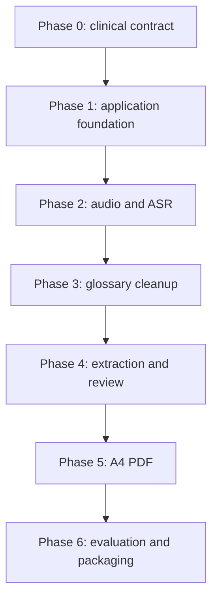

# Ophthalmology Dictation Assistant

## MVP Implementation Task Specification

This document converts the architecture in `architecture.md` into small, testable work packets suitable for implementation by lower-cost or less-capable coding models. It defines a prerequisite Phase 0 and six implementation phases, numbered 1 through 6.

Every task is intended to be assigned independently once its declared dependencies are complete. A task is not complete merely because code was generated; its validation commands and acceptance criteria must pass.

## 1. Execution model

### 1.1 Task sizing

Each task should normally require between two and six focused engineering hours. If an implementing model cannot finish within one context window, the task must be split before work continues.

Each task must:

- Have one primary responsibility.
- Change a small, declared set of files.
- Consume versioned inputs.
- Produce concrete files or test results.
- Include deterministic validation.
- Avoid unresolved architectural decisions.

### 1.2 Capability classes

| Class | Suitable work | Review requirement |
| --- | --- | --- |
| S | Scaffolding, types, deterministic transforms, UI components, tests, documentation | Normal code review |
| M | Native-process integration, model-server clients, concurrency, packaging | Senior engineering review |
| C | Clinical schemas, terminology rules, prompts, protected-data behavior | Ophthalmologist plus senior engineering review |

Class C does not mean that a smaller model cannot implement the task. It means its output cannot be treated as authoritative until the specified human review occurs.

### 1.3 Standard task handoff packet

Give an implementing model only:

1. `architecture.md`.
2. This document's single task specification.
3. Files produced by the task's declared dependencies.
4. Relevant existing source files and tests.
5. The repository's `CLAUDE.md`, formatting, build, and test instructions.

Do not ask the implementing model to redesign the architecture, select a different framework, change clinical meaning, or expand scope.

### 1.4 Standard completion response

Every implementing model must return:

- Files created or modified.
- Concise implementation summary.
- Commands executed.
- Tests that passed or failed.
- Assumptions made.
- Known limitations.
- A statement confirming that unrelated files were not changed.

### 1.5 Global definition of done

A task is complete only when:

- Required outputs exist at the specified paths.
- Type checking passes.
- Relevant unit and integration tests pass.
- No patient data or secrets appear in logs or fixtures.
- Errors are typed and recoverable where specified.
- New behavior is covered by automated tests.
- No downstream interface was changed without updating its schema and consumers.
- The reviewer required by the capability class has approved the result.

## 2. Fixed MVP technical specification

### 2.1 Application stack

| Area | Specification |
| --- | --- |
| Desktop runtime | Electron on 64-bit Windows 10/11 |
| Language | TypeScript with `strict: true` |
| Renderer | React and Vite |
| Package manager | pnpm, exact version pinned in `packageManager` |
| Runtime validation | Zod |
| Unit testing | Vitest |
| UI testing | React Testing Library |
| End-to-end testing | Playwright Electron support or equivalent Electron runner |
| PDF | `pdf-lib` |
| Audio conversion | Bundled FFmpeg executable |
| ASR | NeMo-Speech.cpp with Parakeet TDT 0.6B v3 Q8_0 |
| LLM server | `llama-server`, OpenAI-compatible loopback API |
| Initial LLM profile | Approved 7-9B instruct GGUF in Q4_K_M; 4B Q4_K_M fallback |
| LLM context | 8,192 tokens |
| LLM temperature | 0 for cleanup and extraction |
| LLM reasoning | Thinking and reasoning output disabled |
| Output page | ISO A4 portrait, 595.28 × 841.89 PDF points |

All package versions must be locked in `pnpm-lock.yaml`. Model names, hashes, sizes, and licenses must be pinned in `resources/models/models.manifest.json`; model identifiers must not be duplicated in application code.

### 2.2 Minimum target hardware profile

Until the exact Acer Helios 300 specifications are captured, implementation must remain functional on this conservative target:

- 64-bit Windows 10 or 11.
- 6-core x86-64 CPU with AVX2.
- 16 GB system RAM.
- NVIDIA GPU with 6 GB VRAM, or CPU-only fallback.
- 20 GB free disk space for binaries, models, temporary cases, and installers.
- Internal SSD strongly recommended.

### 2.3 Non-negotiable clinical constraints

- Audio is the evidentiary source.
- The corrected transcript is the operational source for extraction.
- The clinician is the final authority and reviews the completed worksheet once, immediately before export.
- Missing observations carry an explicit status; they never default to normal.
- Laterality, negation, numeric measurements, worksheet ratios, prescription values, and printed worksheet choices cannot be silently changed.
- Every LLM correction records provenance against immutable segment IDs.
- Unresolved and unmapped content stays visible as a field-linked warning on the final worksheet.
- The application accepts and generates no patient identifying information.
- Sessions are ephemeral; working artifacts are purged after successful export.
- Export is blocked until required-review items are resolved and the clinician approves the worksheet.

## 3. Target repository paths

```text
ophthalmology-dictation/
  apps/desktop/
    src/main/
    src/preload/
    src/renderer/
  packages/
    pipeline/
    schemas/
    glossary/
    pdf-template/
    shared/
  resources/
    bin/
      ffmpeg/
      nemo-speech/
      llama.cpp/
    models/
    templates/
  fixtures/
    synthetic/
    deidentified/
  tests/
    unit/
    integration/
    golden/
  docs/
    architecture.md
    mvp-implementation-task-specification.md
  CLAUDE.md
```

## 4. Dependency overview



Tasks inside a phase may run in parallel only when their dependency lists permit it. A phase exit review must pass before the next phase becomes the integration baseline.

# Phase 0 — Clinical contract and test fixtures

Phase 0 is prerequisite work rather than one of the six software implementation phases.

## P0-T01 — Form field inventory

- **Class:** C
- **Depends on:** None
- **Objective:** Convert every visible form item into an unambiguous, stable field inventory.
- **Inputs:** Supplied ocular-health form image; ophthalmologist interview notes.
- **Requirements:** Each field must have a stable ID, visible label, section, laterality rules, type, allowed values, units, observation-status behavior, and clinical explanation. The inventory covers only the worksheet areas fixed in `architecture.md` §2. Ambiguous abbreviations must not be guessed.
- **Process:**
  1. List all OD/OS anterior and posterior fields.
  2. List assessment, plan, prescription, testing, and instruction fields.
  3. Record printed choices and free-text capacity.
  4. Mark every unclear abbreviation as `requires_clinician_definition`.
  5. Review the inventory with the ophthalmologist.
- **Outputs:** `packages/schemas/spec/form-field-inventory.yaml`.
- **Validation:** YAML parses; IDs are unique; every visible form label is accounted for; no unresolved abbreviation is represented as confirmed.
- **Acceptance:** Ophthalmologist approves the inventory in writing.
- **Do not:** Infer the meaning of `ALR`, `FLR`, `VP`, or any other form-specific abbreviation without confirmation.

## P0-T02 — Canonical clinical JSON Schema

- **Class:** C
- **Depends on:** P0-T01
- **Objective:** Define the versioned data contract used by extraction, review, and PDF generation.
- **Inputs:** `form-field-inventory.yaml`.
- **Requirements:** JSON Schema Draft 2020-12; every observation modelled as `{status, value, sourceSegmentIds}`; `additionalProperties: false`; reusable OD/OS definitions; warnings, provenance, unresolved segments, and unmapped statements included.
- **Process:**
  1. Convert inventory types into schema definitions.
  2. Reuse common eye structures through `$defs`.
  3. Add top-level `schemaVersion`.
  4. Add provenance references for populated fields.
  5. Add representative valid and invalid examples.
- **Outputs:** `packages/schemas/src/ocular-exam.schema.json`, `packages/schemas/examples/`.
- **Validation:** Validate examples with Ajv or equivalent; all valid examples pass; every invalid example fails for the intended reason.
- **Acceptance:** Senior engineer and ophthalmologist approve field meaning and observation-status behavior.
- **Do not:** Add diagnoses or plan values not represented by the form contract.

## P0-T03 — Protected-content rules specification

- **Class:** C
- **Depends on:** P0-T01
- **Objective:** Define which transcript elements may never be silently normalized.
- **Inputs:** Field inventory; example dictations from the ophthalmologist.
- **Requirements:** Cover laterality, negation, all numeric measurements, worksheet ratios, glasses and contact-lens prescription values, printed worksheet choices, and explicit self-corrections.
- **Process:**
  1. Define protected token categories.
  2. Provide positive and negative examples for each category.
  3. Define review-blocking behavior: retain the original phrase, record alternatives, emit a blocking warning, and leave the affected field unresolved for the final worksheet.
  4. Define permissible formatting-only changes.
- **Outputs:** `packages/pipeline/spec/protected-content-rules.md`, `fixtures/synthetic/protected-content-cases.json`.
- **Validation:** At least five examples per protected category; each example has expected detection and action.
- **Acceptance:** Ophthalmologist confirms that unsafe transformations are covered.

## P0-T04 — Ophthalmology glossary v1

- **Class:** C
- **Depends on:** P0-T01
- **Objective:** Create the initial versioned glossary used by candidate generation and cleanup.
- **Inputs:** Ophthalmologist-provided terms; field inventory; known Parakeet misrecognitions when available.
- **Requirements:** 100-200 frequent terms; stable ID, canonical term, abbreviation, aliases, ASR confusions, one-line description, anatomical category, expected fields, and confusable terms.
- **Process:**
  1. Create glossary schema.
  2. Enter terms by anatomical category.
  3. Normalize IDs and aliases.
  4. Check duplicates and cycles in `confusableWith`.
  5. Obtain clinician approval.
- **Outputs:** `packages/glossary/src/glossary.schema.json`, `packages/glossary/data/ophthalmology-glossary.v1.json`.
- **Validation:** Schema validation; unique IDs; unique normalized canonical terms; expected field IDs exist in P0-T01.
- **Acceptance:** Ophthalmologist approves every canonical term and description.
- **Do not:** Generate medical definitions without clinician confirmation or an approved reference.

## P0-T05 — Golden case fixture format

- **Class:** C
- **Depends on:** P0-T02, P0-T03, P0-T04
- **Objective:** Define reproducible golden cases for pipeline testing.
- **Inputs:** Five de-identified recordings; approved transcripts; schema; glossary.
- **Requirements:** Each case contains audio reference, verbatim clinician-approved transcript, expected corrected transcript, expected corrections, expected structured JSON, and protected-content annotations.
- **Process:**
  1. Define a fixture manifest schema.
  2. Create five cases covering OD, OS, OU, negation, numbers, and at least one terminology error.
  3. Remove all direct identifiers.
  4. Hash audio files for integrity.
- **Outputs:** `tests/golden/cases/*.json`, `tests/golden/manifest.json`.
- **Validation:** Manifest validation; no direct identifiers; referenced audio hashes match.
- **Acceptance:** Ophthalmologist signs off the expected transcript and structured result for every case.

## Phase 0 exit gate

- All five tasks are approved.
- No unresolved clinical field definition is consumed by implementation.
- Golden fixtures are versioned and de-identified.

# Phase 1 — Electron foundation and hardware profiling

## P1-T01 — Monorepo and quality-tool scaffold

- **Class:** S
- **Depends on:** Phase 0 exit gate
- **Objective:** Create a reproducible TypeScript workspace.
- **Inputs:** Target repository layout in this document.
- **Requirements:** pnpm workspace; TypeScript strict mode; ESLint; Prettier; Vitest; root scripts for build, typecheck, lint, and test.
- **Process:**
  1. Initialize root package metadata and workspace configuration.
  2. Create empty app and package directories.
  3. Add shared TypeScript configuration.
  4. Pin package-manager and dependency versions.
  5. Add a trivial test proving the runner works.
- **Outputs:** Root configuration files and package skeletons.
- **Validation:** `pnpm install --frozen-lockfile`, `pnpm typecheck`, `pnpm lint`, and `pnpm test` pass.
- **Acceptance:** A clean checkout reproduces the same dependency graph.

## P1-T02 — Secure Electron process skeleton

- **Class:** S
- **Depends on:** P1-T01
- **Objective:** Create Electron main, preload, and renderer entry points with a secure default configuration.
- **Inputs:** Electron security requirements from `architecture.md`.
- **Requirements:** `contextIsolation: true`; `nodeIntegration: false`; sandbox enabled where compatible; external navigation denied; permission requests denied by default.
- **Process:**
  1. Create main window factory.
  2. Create preload entry point.
  3. Create minimal React renderer.
  4. Add navigation and permission guards.
  5. Add tests for window configuration.
- **Outputs:** `apps/desktop/src/main/window.ts`, preload and renderer entry files.
- **Validation:** App opens; renderer has no direct Node access; security configuration tests pass.
- **Acceptance:** Security review finds no unrestricted renderer-to-Node bridge.

## P1-T03 — Typed IPC contract and bridge

- **Class:** S
- **Depends on:** P1-T02
- **Objective:** Provide a narrow, validated IPC mechanism.
- **Inputs:** Initial use cases: choose audio, create case, query hardware, run stage, read stage status.
- **Requirements:** Channel allowlist; Zod validation on both sides; typed success/error envelope; no arbitrary command, path, or filesystem IPC.
- **Process:**
  1. Define request and response schemas.
  2. Implement main-process handlers.
  3. Expose typed preload functions.
  4. Add invalid-payload and unknown-channel tests.
- **Outputs:** `packages/shared/src/ipc/`, preload bridge, main handlers.
- **Validation:** Unit tests reject malformed input and unknown methods.
- **Acceptance:** Renderer can perform only declared operations.

## P1-T04 — Ephemeral session workspace and atomic artifact store

- **Class:** S
- **Depends on:** P1-T01, P0-T02
- **Objective:** Implement isolated temporary session directories and atomic stage artifacts.
- **Inputs:** Session structure and states from `architecture.md` §10.
- **Requirements:** Randomly named session IDs; no patient-derived content in any path; write-to-temp then atomic rename; explicit artifact versions; path traversal protection; purge on successful export; removal of abandoned sessions at startup; no option to retain a session.
- **Process:**
  1. Implement session creation under a private temporary root.
  2. Implement typed artifact read/write for `metadata.json`, `prepared.wav`, `asr.json`, `cleanup.json`, `extraction.json`, `worksheet.json`, and `preview.pdf`.
  3. Add atomic-write helper.
  4. Implement purge and startup orphan cleanup.
  5. Test interrupted writes and interrupted purges.
- **Outputs:** `packages/pipeline/src/session-store/`.
- **Validation:** Unit tests for creation, atomicity, corrupted artifact handling, purge, orphan cleanup, and path traversal.
- **Acceptance:** A simulated crash never replaces a valid artifact with a partial file, and no session survives a successful export.

## P1-T05 — Workflow state machine

- **Class:** S
- **Depends on:** P1-T04
- **Objective:** Enforce legal pipeline transitions and resumability.
- **Inputs:** Imported → Prepared → Transcribed → Corrected → Extracted → FinalReview → Approved → Exported → Purged.
- **Requirements:** Idempotent transition checks; failure state stored separately from last successful state; retries do not erase prior artifacts.
- **Process:**
  1. Define state and event types.
  2. Implement transition reducer.
  3. Persist current state in metadata.
  4. Add resume logic based on verified artifacts.
- **Outputs:** `packages/pipeline/src/state-machine/`.
- **Validation:** Table-driven tests for every allowed and forbidden transition.
- **Acceptance:** An interrupted active session resumes at the last valid completed stage; completed sessions are not reopenable.

## P1-T06 — Hardware probe

- **Class:** M
- **Depends on:** P1-T03
- **Objective:** Detect the Helios 300's relevant hardware without collecting unrelated device information.
- **Inputs:** Windows host; `nvidia-smi` when present.
- **Requirements:** CPU name and logical cores; system RAM; GPU name; total and currently free VRAM; free disk; feature flags for CUDA and AVX2; typed `unknown` values when detection fails.
- **Process:**
  1. Query Windows system APIs or PowerShell through a fixed internal command.
  2. Query `nvidia-smi` with fixed arguments.
  3. Parse outputs without shell interpolation.
  4. Normalize into `HardwareProfile`.
  5. Add fixture-based parser tests.
- **Outputs:** `apps/desktop/src/main/hardware/`, `packages/shared/src/hardware.ts`.
- **Validation:** Parser tests for 4, 6, 8, and 12 GB GPUs; test missing `nvidia-smi` and malformed output.
- **Acceptance:** Actual Helios output is captured and manually verified.

## P1-T07 — Hardware execution-profile selector

- **Class:** S
- **Depends on:** P1-T06
- **Objective:** Map detected hardware to deterministic ASR and LLM settings.
- **Inputs:** `HardwareProfile`; profile table from `architecture.md`.
- **Requirements:** Profiles for 12+ GB, 8 GB, 6 GB, 4 GB, and CPU-only; selected parameters include ASR device, LLM model ID, GPU layers, concurrency mode, and warning text.
- **Process:**
  1. Define versioned profile configuration.
  2. Implement pure selection function.
  3. Add boundary-value tests.
  4. Support an advanced manual override stored in settings.
- **Outputs:** `packages/pipeline/src/hardware-profiles/`.
- **Validation:** Table-driven tests cover exact thresholds and unknown VRAM.
- **Acceptance:** Helios 300 receives a valid profile and an understandable fallback if detection fails.

## P1-T08 — Owned-process supervisor

- **Class:** M
- **Depends on:** P1-T03, P1-T05
- **Objective:** Start, monitor, restart, and terminate bundled native processes safely.
- **Inputs:** Executable manifest; fixed argument arrays; health-check definition.
- **Requirements:** No shell invocation; captured exit code; bounded startup timeout; one automatic restart; graceful shutdown followed by forced termination; logs scrubbed of patient content.
- **Process:**
  1. Implement child-process wrapper.
  2. Implement lifecycle states and health polling.
  3. Implement cancellation with `AbortSignal`.
  4. Add fake-process integration fixtures.
- **Outputs:** `apps/desktop/src/main/process-supervisor/`.
- **Validation:** Integration tests for success, timeout, crash, restart, cancellation, and shutdown.
- **Acceptance:** No child process remains after Electron exits in automated tests.

## P1-T09 — Session shell UI

- **Class:** S
- **Depends on:** P1-T03, P1-T05, P1-T07
- **Objective:** Provide the initial import and progress interface.
- **Inputs:** IPC methods and state-machine types.
- **Requirements:** Import button; current stage; recoverable error display; retry button; hardware-profile summary; resume or discard an interrupted active session.
- **Process:**
  1. Implement case home screen.
  2. Implement progress component driven by state.
  3. Implement error boundary.
  4. Add accessible labels and keyboard flow.
- **Outputs:** Renderer components and tests.
- **Validation:** Component tests for every state and error path.
- **Acceptance:** User can import and resume a placeholder session without renderer console errors.

## P1-T10 — Fixture-driven walking skeleton

- **Class:** S
- **Depends on:** P1-T04, P1-T05, P1-T09
- **Objective:** Prove the whole path from import to purge using fixtures, before any model integration.
- **Inputs:** Sample audio fixture; fake ASR result; fake worksheet data conforming to the clinical schema.
- **Requirements:** No real inference; every stage boundary exercised; runs from an installed offline build.
- **Process:**
  1. Wire import to a fake ASR provider returning a fixture transcript.
  2. Feed fixture worksheet data into the editable final worksheet.
  3. Generate a draft A4 preview and export a PDF.
  4. Purge the session and verify nothing remains.
  5. Run the slice against an installed build with networking disabled.
- **Outputs:** Fake providers, fixture wiring, and an end-to-end smoke test.
- **Validation:** The smoke test passes offline from an installed build.
- **Acceptance:** IPC, session storage, state transitions, templating, preview, export, and purge are proven before model work begins.

## Phase 1 exit gate

- Security configuration, IPC, storage, state machine, hardware selection, and process supervision tests pass.
- Exact Helios CPU, RAM, GPU, VRAM, and disk measurements are recorded.
- The fixture-driven walking skeleton reaches worksheet preview, export, and purge from an installed build.
- No inference model is required to pass this gate.

# Phase 2 — Audio preprocessing and Parakeet transcription

## P2-T01 — Native executable manifest

- **Class:** S
- **Depends on:** Phase 1 exit gate
- **Objective:** Define how FFmpeg, NeMo-Speech.cpp, and llama.cpp binaries are located and verified.
- **Inputs:** Packaged executable names and approved SHA-256 hashes.
- **Requirements:** Platform/architecture keys; relative packaged path; version; hash; license path; no executable download during clinical runtime.
- **Process:**
  1. Define manifest schema.
  2. Add Windows x64 entries.
  3. Implement path resolution through `process.resourcesPath`.
  4. Implement preflight hash verification.
- **Outputs:** `resources/bin/binaries.manifest.json`, resolver module and tests.
- **Validation:** Tests reject missing, altered, wrong-platform, and hash-mismatched binaries.
- **Acceptance:** Packaged and development modes resolve binaries without hardcoded absolute paths.

## P2-T02 — Audio import validation

- **Class:** S
- **Depends on:** P1-T04, P2-T01
- **Objective:** Reject unsupported or unsafe input before conversion.
- **Inputs:** User-selected path.
- **Requirements:** Allow WAV, MP3, M4A/AAC, and FLAC; inspect actual media metadata with `ffprobe`; configurable maximum duration and file size; copy into the session workspace under a random name, leaving the source file unmodified.
- **Process:**
  1. Validate extension and file signature/metadata.
  2. Extract duration, codec, channels, sample rate, and size.
  3. Enforce limits.
  4. Copy original without modifying it.
- **Outputs:** `packages/pipeline/src/audio/import-audio.ts`, metadata artifact.
- **Validation:** Tests for supported formats, renamed non-audio file, zero-byte file, excessive duration, and path traversal.
- **Acceptance:** Invalid inputs fail before the Prepared stage and produce a user-safe error.

## P2-T03 — Canonical audio conversion

- **Class:** M
- **Depends on:** P2-T02, P1-T08
- **Objective:** Produce deterministic 16 kHz mono PCM audio.
- **Inputs:** Imported audio path and metadata.
- **Requirements:** PCM signed 16-bit little-endian; mono; 16 kHz. Conversion-only is the default. High-pass, loudness-normalization, and denoising profiles are versioned, disabled by default, and enabled only where evaluation on the intended clinician's recordings shows improved critical-term recovery.
- **Process:**
  1. Build fixed FFmpeg argument arrays.
  2. Produce `prepared.wav` atomically.
  3. Verify output with `ffprobe`.
  4. Record command version and filter profile, excluding patient paths from logs.
- **Outputs:** Audio preprocessing service, `audio-preparation.json` artifact.
- **Validation:** Fixture tests assert codec, channel count, rate, nonzero duration, and bounded duration drift.
- **Acceptance:** Every supported input fixture generates a valid canonical WAV.

## P2-T04 — ASR provider contract

- **Class:** S
- **Depends on:** P0-T05, P1-T01
- **Objective:** Define an engine-neutral speech-recognition interface.
- **Inputs:** Required transcript and timestamp data.
- **Requirements:** Typed request/result/error; cancellation; progress events; model metadata; no engine-specific types outside adapters.
- **Process:**
  1. Define `AsrProvider`, result, segment, token, and error types.
  2. Add a deterministic fake provider.
  3. Add contract tests reusable by every provider.
- **Outputs:** `packages/pipeline/src/asr/contract.ts`, fake provider, contract tests.
- **Validation:** Fake provider passes the contract suite.
- **Acceptance:** Downstream code imports only the contract, not NeMo-specific code.

## P2-T05 — NeMo-Speech.cpp Parakeet adapter

- **Class:** M
- **Depends on:** P2-T01, P2-T03, P2-T04, P1-T08
- **Objective:** Run local Parakeet transcription and normalize its structured output.
- **Inputs:** `prepared.wav`; selected hardware profile; Parakeet model manifest entry.
- **Requirements:** English mode when supported; timestamps enabled; fixed CLI arguments; structured output parsed defensively; timeout based on audio duration; cancellation supported.
- **Process:**
  1. Implement CLI invocation through the process supervisor.
  2. Parse transcript and timestamps.
  3. Normalize to `AsrResult`.
  4. Persist model version, quantization, device, duration, and real-time factor.
  5. Map failures to typed errors.
- **Outputs:** `packages/pipeline/src/asr/nemo-speech-provider.ts`, `asr.json` writer.
- **Validation:** Contract tests; integration test with short synthetic audio; malformed-output test; cancellation test.
- **Acceptance:** A prerecorded file produces a nonempty local transcript with usable timestamps while networking is disabled.

## P2-T06 — Transcript artifact validator

- **Class:** S
- **Depends on:** P2-T04, P2-T05
- **Objective:** Prevent corrupt or incomplete ASR artifacts from advancing the state machine.
- **Inputs:** `asr.json`.
- **Requirements:** Schema version; nonnegative ordered timestamps; segments within audio duration; nonempty model identifier; transcript reconstructed from segments within defined normalization tolerance.
- **Process:**
  1. Define Zod schema.
  2. Implement semantic validation.
  3. Integrate validation before Transcribed transition.
- **Outputs:** ASR artifact schema and validator.
- **Validation:** Valid, unordered, overlapping, negative, out-of-range, and empty fixtures.
- **Acceptance:** Invalid artifacts never advance the workflow.

## P2-T07 — Audio replay service and development transcript inspector

- **Class:** S
- **Depends on:** P1-T09, P2-T06
- **Objective:** Provide field-level audio replay for the final worksheet, plus a development-only transcript inspector.
- **Inputs:** Canonical audio exposed safely by the main process; validated ASR segments.
- **Requirements:** Play, pause, seek, and current time driven by segment ID; no direct filesystem URL; the raw transcript view is a development aid and is not part of the clinician workflow.
- **Process:**
  1. Implement a secure media protocol or bounded IPC streaming.
  2. Implement seek-to-segment playback controls.
  3. Build the development transcript inspector behind a development flag.
  4. Expose a replay hook the final worksheet can call for a highlighted field.
- **Outputs:** Replay service, development inspector, and tests.
- **Validation:** Component tests for seek and active-segment tracking; end-to-end smoke test with fixture audio.
- **Acceptance:** Requesting replay for a segment ID seeks within 250 ms of its start timestamp.

## P2-T08 — Offline ASR integration suite

- **Class:** M
- **Depends on:** P2-T03, P2-T05, P2-T06, P2-T07
- **Objective:** Verify the complete import-to-transcript slice.
- **Inputs:** Synthetic audio fixtures and one approved de-identified sample.
- **Requirements:** Run with networking blocked; cover CPU fallback; preserve original audio; record performance without patient text.
- **Process:**
  1. Create integration harness.
  2. Run import, preparation, ASR, artifact validation, and UI load.
  3. Simulate service crash and retry.
  4. Record timing assertions with generous hardware-aware bounds.
- **Outputs:** `tests/integration/audio-asr/`.
- **Validation:** Suite passes on development machine and Helios 300.
- **Acceptance:** Phase slice works offline and recovers from one forced ASR failure.

## Phase 2 exit gate

- All supported audio formats reach a validated timestamped transcript.
- Original audio is unchanged.
- Parakeet operates offline on the Helios 300 using at least one valid execution profile.

# Phase 3 — Glossary-aware terminology correction

## P3-T01 — Glossary loader and index

- **Class:** S
- **Depends on:** P0-T04, Phase 2 exit gate
- **Objective:** Load and query a versioned glossary deterministically.
- **Inputs:** Approved glossary v1 and schema.
- **Requirements:** Validate before use; normalized lookup indexes for IDs, canonical terms, aliases, confusions, categories, and expected fields; immutable runtime representation.
- **Process:**
  1. Implement normalization shared by indexing and lookup.
  2. Validate glossary schema and referential integrity.
  3. Build indexes.
  4. Expose read-only query methods.
- **Outputs:** `packages/glossary/src/loader.ts`, index types and tests.
- **Validation:** Duplicate, broken reference, invalid field ID, and normalization-collision tests.
- **Acceptance:** Glossary loads once and produces deterministic indexes.

## P3-T02 — Transcript span tokenizer

- **Class:** S
- **Depends on:** P2-T06
- **Objective:** Create timestamp-aware candidate spans without modifying clinical text.
- **Inputs:** ASR segments or words.
- **Requirements:** Preserve original offsets; generate one- to five-token spans; associate start/end times; avoid crossing long pauses or segment boundaries unless configured.
- **Process:**
  1. Normalize for comparison while preserving original text.
  2. Generate bounded n-grams.
  3. Attach offsets and timestamps.
  4. Deduplicate spans.
- **Outputs:** `packages/pipeline/src/cleanup/span-tokenizer.ts`.
- **Validation:** Unit tests for punctuation, abbreviations, decimals, OD/OS, pauses, and repeated words.
- **Acceptance:** Protected numeric and laterality tokens retain exact original text and locations.

## P3-T03 — Lexical and alias candidate generator

- **Class:** S
- **Depends on:** P3-T01, P3-T02
- **Objective:** Retrieve plausible glossary terms using deterministic text similarity.
- **Inputs:** Timestamped spans and glossary indexes.
- **Requirements:** Exact alias and known-confusion matches first; normalized edit-distance and token similarity afterward; maximum five candidates per span; configurable thresholds.
- **Process:**
  1. Implement exact normalized matching.
  2. Implement bounded fuzzy matching.
  3. Score and rank candidates.
  4. Filter weak candidates.
- **Outputs:** `packages/pipeline/src/cleanup/lexical-candidates.ts`.
- **Validation:** Golden typo and known-confusion fixtures; unrelated phrases produce no candidate.
- **Acceptance:** All glossary confusions in Phase 0 fixtures appear in the top three candidates.

## P3-T04 — Phonetic candidate generator

- **Class:** S
- **Depends on:** P3-T01, P3-T02
- **Objective:** Recover terms that are acoustically similar but textually dissimilar.
- **Inputs:** Transcript spans and glossary aliases.
- **Requirements:** English phonetic encoding suitable for multiword terms; original and normalized scores retained; protected-content spans excluded from automatic replacement.
- **Process:**
  1. Implement or wrap a deterministic phonetic encoder.
  2. Encode glossary terms at index time.
  3. Rank phonetic matches.
  4. Add Indian-accent confusion fixtures supplied by the clinician.
- **Outputs:** `packages/pipeline/src/cleanup/phonetic-candidates.ts`.
- **Validation:** Tests for dropped vowels, voiced/unvoiced consonants, multiword terms, and unrelated controls.
- **Acceptance:** Clinician-provided accent confusions appear in the top five without materially increasing false positives on controls.

## P3-T05 — Candidate merge and context packer

- **Class:** S
- **Depends on:** P3-T03, P3-T04
- **Objective:** Produce a small, deterministic context packet for the cleanup LLM.
- **Inputs:** Lexical and phonetic candidate lists; surrounding transcript; glossary metadata.
- **Requirements:** Deduplicate by glossary ID; preserve component scores; cap total candidates and prompt size; include one-line descriptions and expected fields; exclude irrelevant glossary entries.
- **Process:**
  1. Merge and rescore candidates.
  2. Select local transcript context.
  3. Build typed context packets.
  4. Add token-budget estimation.
- **Outputs:** `packages/pipeline/src/cleanup/context-packer.ts`.
- **Validation:** Determinism, deduplication, candidate caps, and token-budget tests.
- **Acceptance:** Every golden confusion receives its expected term while packets remain under the configured budget.

## P3-T06 — llama.cpp server manager and client

- **Class:** M
- **Depends on:** P1-T07, P1-T08, P2-T01
- **Objective:** Start `llama-server` with the selected profile and provide a typed local client.
- **Inputs:** Model manifest; hardware profile; fixed server configuration.
- **Requirements:** Loopback binding; random available port; readiness check; 8K context; temperature supplied per request; request timeout and cancellation; no prompts logged.
- **Process:**
  1. Implement server argument builder.
  2. Start and health-check server through process supervisor.
  3. Implement OpenAI-compatible chat client.
  4. Add schema response support.
  5. Map HTTP and model errors to typed errors.
- **Outputs:** `packages/pipeline/src/llm/llama-server-manager.ts`, client and tests.
- **Validation:** Fake-server tests; real smoke test; timeout, malformed JSON, cancellation, and restart tests.
- **Acceptance:** Client obtains a schema-constrained response locally without exposing prompts in logs.

## P3-T07 — Cleanup output schema and prompt

- **Class:** C
- **Depends on:** P0-T03, P3-T05, P3-T06
- **Objective:** Produce auditable terminology corrections without changing protected content.
- **Inputs:** Raw transcript, context packets, glossary version, protected-content rules.
- **Requirements:** Output corrected transcript, explicit corrections, unresolved segments, timestamps, glossary IDs, `candidateSource`, `deterministicCandidateRank`, `protectedContentTouched`, and reasons; temperature 0; missing data never inferred. The model emits no self-assigned confidence score, and no safety decision may depend on one.
- **Process:**
  1. Define cleanup JSON Schema and Zod mirror.
  2. Write system and user prompt templates.
  3. Add few-shot examples from approved synthetic fixtures.
  4. Call llama.cpp with schema constraints.
  5. Validate output before persistence.
- **Outputs:** `packages/schemas/src/cleanup.schema.json`, prompt templates, cleanup service.
- **Validation:** Golden correction fixtures; prompt-injection text inside transcript is treated as transcript content; invalid model output is rejected.
- **Acceptance:** Every correction has provenance; the golden set contains no silent protected-content alteration; ophthalmologist approves example behavior.

## P3-T08 — Protected-content detector and correction guard

- **Class:** C
- **Depends on:** P0-T03, P3-T07
- **Objective:** Independently detect unsafe cleanup changes even if the LLM violates instructions.
- **Inputs:** Raw transcript, corrected transcript, correction records, protected-content fixtures from P0-T03.
- **Requirements:** Deterministic comparison of laterality, negation, numeric measurements, worksheet ratios, glasses and contact-lens prescription values, and printed worksheet choices; every difference creates a blocking warning and leaves the affected field unresolved.
- **Process:**
  1. Implement protected token extraction.
  2. Compare raw and corrected multisets with locations.
  3. Cross-check declared corrections.
  4. Add blocking validation results.
- **Outputs:** `packages/pipeline/src/cleanup/protected-content-guard.ts`.
- **Validation:** Full P0-T03 fixture suite plus mutation tests.
- **Acceptance:** Every seeded protected-content mutation is detected.

## P3-T09 — Cleanup trace and final-screen warning adapter

- **Class:** S
- **Depends on:** P2-T07, P3-T07, P3-T08
- **Objective:** Record every cleanup decision internally and convert cleanup risk into field-linked warnings for the final worksheet.
- **Inputs:** Raw transcript, cleanup result, guard findings, audio timestamps.
- **Requirements:** Every correction traced with segment IDs, glossary ID, candidate evidence, deterministic rank, and audio time; blocking warnings mapped to the worksheet fields they affect; ambiguous protected content left unresolved rather than applied; no separate correction-approval screen.
- **Process:**
  1. Build the internal cleanup trace artifact.
  2. Map guard findings and unresolved spans onto target field paths.
  3. Emit a typed warning list keyed by field.
  4. Mark affected fields unresolved for extraction.
- **Outputs:** `cleanup.json` trace and the warning adapter module.
- **Validation:** Unit tests for trace completeness, field mapping, and unresolved propagation.
- **Acceptance:** Every blocking cleanup finding reaches the final worksheet attached to a specific field.

## P3-T10 — Glossary confusion-alias proposal workflow

- **Class:** S
- **Depends on:** P3-T09
- **Objective:** Capture recurring confirmed ASR errors without automatically changing the approved glossary.
- **Inputs:** Corrections confirmed by the clinician's acceptance of the exported worksheet.
- **Requirements:** Generate proposals only; include count and examples stripped of patient context; duplicate detection; no automatic promotion into glossary v1.
- **Process:**
  1. Extract raw/canonical pairs from approvals.
  2. Normalize and aggregate counts.
  3. Write proposal artifact.
  4. Provide export for later clinician review.
- **Outputs:** `glossary-alias-proposals.json` and tests.
- **Validation:** Rejected corrections do not become proposals; patient context is absent.
- **Acceptance:** Glossary remains immutable during a case.

## Phase 3 exit gate

- Cleanup improves medical-term recovery on the development fixtures.
- Every change is traceable to immutable segment IDs, audio time, glossary ID, candidate evidence, and deterministic rank.
- Seeded protected-content changes are blocked.
- Uncertain corrections become field warnings or unresolved values on the final worksheet.
- The ophthalmologist approves cleanup behavior on the initial real samples.

# Phase 4 — Structured extraction, validation, and final worksheet review

## P4-T01 — Generated TypeScript clinical types

- **Class:** S
- **Depends on:** P0-T02, Phase 3 exit gate
- **Objective:** Ensure the JSON Schema and TypeScript types cannot drift.
- **Inputs:** Approved ocular examination JSON Schema.
- **Requirements:** Repeatable code generation or a single-source Zod/schema strategy; no hand-maintained duplicate interfaces.
- **Process:**
  1. Add type-generation script.
  2. Generate types into a clearly marked file.
  3. Add CI drift check.
- **Outputs:** Generated clinical types and script.
- **Validation:** Regeneration produces no diff; schema examples typecheck.
- **Acceptance:** CI fails when generated types are stale.

## P4-T02 — Extraction prompt and service

- **Class:** C
- **Depends on:** P3-T07, P4-T01, P3-T06
- **Objective:** Convert the reviewed corrected transcript into schema-valid form data.
- **Inputs:** Corrected transcript; raw transcript; accepted corrections; glossary IDs; ocular-exam schema.
- **Requirements:** Corrected transcript is primary; raw data supplies provenance; missing observations carry status `not_mentioned`; the model may emit only `not_mentioned`, `observed_normal`, or `observed_abnormal`, and only with dictation support; no inferred normal findings; all unrepresented content goes to `unmappedStatements`; temperature 0.
- **Process:**
  1. Write extraction prompt template.
  2. Add approved few-shot examples.
  3. Invoke llama.cpp with the exact JSON Schema.
  4. Validate and persist extraction artifact.
- **Outputs:** `packages/pipeline/src/extraction/`, prompt templates, `extraction.json`.
- **Validation:** Golden cases; an omitted finding stays `not_mentioned`; irrelevant and malicious transcript instructions cannot modify the prompt contract.
- **Acceptance:** All golden outputs are schema-valid and no expected statement disappears.

## P4-T03 — Field provenance linker

- **Class:** M
- **Depends on:** P4-T02, P2-T06
- **Objective:** Link populated fields to transcript spans and audio times.
- **Inputs:** Extraction output, raw/corrected transcripts, ASR timestamps, correction metadata.
- **Requirements:** Each populated model-derived field has one or more source spans; clinician-created fields are marked `clinician_edit`; unresolved links become warnings.
- **Process:**
  1. Define provenance record format.
  2. Resolve cited text to corrected and raw spans.
  3. Map spans to audio timestamps.
  4. Validate coverage.
- **Outputs:** Provenance module and enriched extraction artifact.
- **Validation:** Golden fields seek to expected audio intervals; missing evidence produces warning.
- **Acceptance:** No populated model-derived field is silently accepted without provenance.

## P4-T04 — Clinical validation engine

- **Class:** C
- **Depends on:** P0-T01, P0-T03, P4-T02, P4-T03
- **Objective:** Apply deterministic rules after extraction and clinician editing.
- **Inputs:** Clinical JSON, field inventory, protected rules, provenance.
- **Requirements:** Structural, range, format, laterality, mutual-exclusion, provenance, unresolved, and overflow-precheck rules; severity levels `info`, `warning`, `blocking`.
- **Process:**
  1. Create validator interface and result type.
  2. Implement one rule per module.
  3. Add stable rule IDs and messages.
  4. Run rules after extraction and every edit.
- **Outputs:** `packages/pipeline/src/validation/`.
- **Validation:** At least one pass and fail fixture per rule; mutation tests for critical rules.
- **Acceptance:** All P0 protected-content violations are blocking.

## P4-T05 — Final worksheet review screen

- **Class:** S
- **Depends on:** P4-T01, P4-T04, P1-T09
- **Objective:** Render the single editable worksheet laid out like the exported A4 form.
- **Inputs:** Typed clinical data, field inventory, validation results.
- **Requirements:** OD/OS sections clearly separated; the form's printed choices reproduced; correct controls by field type; all six observation statuses selectable and visually distinct; autosave through validated IPC; accessible keyboard navigation.
- **Process:**
  1. Build field-renderer registry.
  2. Build anterior, posterior, assessment, and plan sections matching the printed layout.
  3. Integrate validation messages inline.
  4. Persist edits with provenance `clinician_edit` and rerun validation on every change.
- **Outputs:** Final worksheet components and tests.
- **Validation:** Component tests for every field type, status handling, laterality labels, and validation display.
- **Acceptance:** Clinician can edit every schema field and set any observation status without raw JSON manipulation.

## P4-T06 — Field-linked warning list

- **Class:** S
- **Depends on:** P3-T09, P4-T02, P4-T05
- **Objective:** Surface every uncertain or unrepresented statement on the same final worksheet, attached to the field it affects.
- **Inputs:** Unresolved cleanup spans, extraction warnings, unmapped statements.
- **Requirements:** One compact warning list on the final screen; each entry links to its worksheet field; audio replay where timestamps exist; actions to map, dismiss with reason, or retain as a note; blocking status visible; no separate review workflow.
- **Process:**
  1. Render the warning list beside the worksheet.
  2. Wire each entry to focus and highlight its field.
  3. Add resolution actions and reason capture.
  4. Revalidate after every action.
- **Outputs:** Warning list component and resolution state on `worksheet.json`.
- **Validation:** Tests for all actions, field linking, and blocking-state changes.
- **Acceptance:** Every unresolved item has a recorded disposition before approval becomes available.

## P4-T07 — Clinician approval gate

- **Class:** C
- **Depends on:** P4-T04, P4-T05, P4-T06
- **Objective:** Prevent unreviewed worksheets from reaching export.
- **Inputs:** Reviewed data, validation results, resolution artifact.
- **Requirements:** Approval enabled only when no blocking issues remain; confirmation records timestamp, application version, schema version, glossary version, and content hash; editing after approval invalidates approval.
- **Process:**
  1. Implement approval eligibility function.
  2. Implement approval record and content hashing.
  3. Invalidate on data mutation.
  4. Add UI confirmation.
- **Outputs:** Approval module, approved `worksheet.json`, approval UI.
- **Validation:** Tests for every blocking condition, mutation invalidation, and hash change.
- **Acceptance:** Export services cannot accept an unapproved or stale-hash case.

## P4-T08 — Golden extraction integration suite

- **Class:** M
- **Depends on:** P4-T02 through P4-T07
- **Objective:** Verify cleanup-to-approval behavior against approved cases.
- **Inputs:** Golden fixtures and deterministic fake/recorded LLM responses.
- **Requirements:** Tests must not depend on nondeterministic live generation for normal CI; separate opt-in real-model suite.
- **Process:**
  1. Add recorded response fixtures.
  2. Test schema extraction, provenance, validation, editing, resolution, and approval.
  3. Add opt-in real llama.cpp run.
- **Outputs:** `tests/golden/extraction-review/`.
- **Validation:** Standard suite passes offline without models; opt-in suite passes on the selected model.
- **Acceptance:** All five initial golden cases reach the exact approved reviewed JSON.

## Phase 4 exit gate

- Schema validity is 100% on golden cases.
- Missing observations remain `not_mentioned` rather than becoming normal findings.
- Every populated model field has provenance or a visible warning.
- Unmapped statements are never silently dropped.
- Approval is impossible with unresolved blocking issues.

# Phase 5 — A4 PDF template and export

## P5-T01 — A4 vector template specification

- **Class:** C
- **Depends on:** P0-T01, Phase 4 exit gate
- **Objective:** Recreate the supplied form as a clean A4 vector layout.
- **Inputs:** Form image, approved field inventory, A4 dimensions.
- **Requirements:** 595.28 × 841.89 points; readable at 100% zoom and print; diagrams retained; no clinical field omitted; branding omitted unless separately approved.
- **Process:**
  1. Establish margins and section grid.
  2. Draw headings, lines, selection marks, and diagrams with vectors.
  3. Assign template version.
  4. Render and review with ophthalmologist.
- **Outputs:** `packages/pdf-template/src/template.ts`, reference PDF and PNG.
- **Validation:** Exact page dimensions; visual inspection at screen and print scale.
- **Acceptance:** Ophthalmologist approves layout and terminology.

## P5-T02 — Normalized field coordinate map

- **Class:** S
- **Depends on:** P5-T01, P0-T02
- **Objective:** Map every renderable schema path to a template region.
- **Inputs:** Clinical schema and approved template.
- **Requirements:** Normalized x/y/width/height; control type; font rules; line limit; alignment; mark locations; no orphaned renderable schema field.
- **Process:**
  1. Define coordinate-map schema.
  2. Add entries for every field.
  3. Add coverage checker against clinical schema.
- **Outputs:** `packages/pdf-template/data/field-map.v1.json`, map schema and tests.
- **Validation:** Coverage test; coordinates remain inside page and do not overlap forbidden regions.
- **Acceptance:** All MVP fields either map to the PDF or are explicitly marked non-rendered with a reason.

## P5-T03 — Deterministic PDF field renderer

- **Class:** S
- **Depends on:** P5-T01, P5-T02, P4-T07
- **Objective:** Render approved clinical values without using an LLM.
- **Inputs:** Approved `worksheet.json`, template, coordinate map.
- **Requirements:** Embedded font; stable formatting; each observation status renders according to the clinician-approved policy; arrays render in defined order; choice marks are deterministic; PDF metadata carries no clinical content.
- **Process:**
  1. Implement coordinate conversion.
  2. Implement renderers for text, multiline text, marks, and tables.
  3. Render the approved data.
  4. Save atomically.
- **Outputs:** `packages/pdf-template/src/render-pdf.ts` and tests.
- **Validation:** Same input produces semantically identical output; extracted PDF text contains expected values.
- **Acceptance:** Export service rejects unapproved input.

## P5-T04 — Text wrapping and overflow validator

- **Class:** S
- **Depends on:** P5-T02, P5-T03
- **Objective:** Prevent clipped or unreadable PDF content.
- **Inputs:** Field regions, font metrics, values.
- **Requirements:** Word wrapping; maximum lines; minimum font size; explicit overflow error; no silent truncation. The MVP output is this single page, so a field that still overflows is flagged for the clinician to shorten; no continuation page is generated.
- **Process:**
  1. Implement line-breaking with embedded-font metrics.
  2. Implement font-size fallback to the approved minimum.
  3. Return overflow diagnostics before final export.
- **Outputs:** Layout module and overflow tests.
- **Validation:** Boundary strings, long medical terms, long assessment, and impossible-fit fixtures.
- **Acceptance:** Every clipped-text mutation is detected before export.

## P5-T05 — PDF preview

- **Class:** S
- **Depends on:** P5-T03, P5-T04
- **Objective:** Show the exact export candidate inside the review workflow.
- **Inputs:** Generated preview PDF.
- **Requirements:** Safe local document protocol; zoom; page fit; refresh after approved-data changes; no remote PDF viewer dependency.
- **Process:**
  1. Generate preview from current reviewed data.
  2. Expose through secure local protocol.
  3. Render with bundled viewer.
  4. Regenerate when approval becomes stale.
- **Outputs:** Preview component and main-process service.
- **Validation:** End-to-end test renders the reference case and refreshes after an edit/reapproval.
- **Acceptance:** Preview bytes are the same bytes offered for export.

## P5-T06 — Export transaction

- **Class:** M
- **Depends on:** P4-T07, P5-T03, P5-T04, P5-T05
- **Objective:** Export the approved PDF and optional JSON safely.
- **Inputs:** Approved case hash, PDF bytes, reviewed JSON, user-selected destination.
- **Requirements:** Save dialog; atomic output write; explicit overwrite confirmation; export metadata; no temporary file left on failure. Internal transcripts and JSON are never offered as an export.
- **Process:**
  1. Revalidate approval and content hash.
  2. Generate final bytes.
  3. Write temporary destination file.
  4. Atomically replace after confirmation.
  5. Transition to Exported, then purge the session.
- **Outputs:** Export service, `export-metadata.json`, UI action.
- **Validation:** Tests for cancel, existing file, disk full, stale approval, successful export, and post-export purge.
- **Acceptance:** Exported PDF matches the approved content hash, no partial target remains after failure, and no session survives a successful export.

## P5-T07 — PDF visual regression suite

- **Class:** M
- **Depends on:** P5-T01 through P5-T06
- **Objective:** Detect layout regressions automatically.
- **Inputs:** Approved reference cases.
- **Requirements:** Render PDFs to images at a fixed DPI; compare page size, text extraction, and image differences with documented tolerance; store reference images without patient data.
- **Process:**
  1. Add PDF renderer in test environment.
  2. Generate reference outputs.
  3. Implement pixel and structural comparison.
  4. Produce diff image on failure.
- **Outputs:** `tests/golden/pdf/`, reference images and comparison script.
- **Validation:** Intentional one-point displacement and clipped-text mutations fail.
- **Acceptance:** Approved reference PDFs pass consistently on CI and Windows.

## Phase 5 exit gate

- PDF is exact A4 portrait.
- All renderable fields are covered.
- No content is clipped or silently truncated.
- Exported bytes match the approved worksheet state.
- The session is purged after a successful export.
- Ophthalmologist approves the printed form.

# Phase 6 — Evaluation, hardening, packaging, and MVP release

## P6-T01 — De-identified evaluation corpus manifest

- **Class:** C
- **Depends on:** Phase 5 exit gate
- **Objective:** Expand evaluation to at least 30 representative recordings.
- **Inputs:** Clinician-provided recordings and approved annotations.
- **Requirements:** No direct identifiers; stable train/development/held-out split; speaker and condition metadata without identity; audio hash; consent/usage status; protected-content annotations.
- **Process:**
  1. Define corpus manifest schema.
  2. De-identify and inspect each recording.
  3. Assign split before prompt or glossary tuning.
  4. Lock held-out annotations.
- **Outputs:** `fixtures/deidentified/corpus-manifest.json` and secured local audio references.
- **Validation:** Schema, hashes, split uniqueness, and de-identification checklist.
- **Acceptance:** Ophthalmologist approves all reference annotations; held-out cases remain untouched during tuning.

## P6-T02 — ASR benchmark adapters

- **Class:** M
- **Depends on:** P2-T04, P6-T01
- **Objective:** Run comparable inference for Parakeet v3 and Whisper large-v3-turbo; optionally Parakeet v2.
- **Inputs:** ASR provider contract, corpus, approved model manifests.
- **Requirements:** Identical audio input; isolated result directories; captured model/device/runtime metadata; no network inference.
- **Process:**
  1. Implement Whisper provider behind the existing contract.
  2. Add benchmark runner.
  3. Run providers over the same manifest.
  4. Persist raw results without overwriting.
- **Outputs:** Additional provider, benchmark results, run manifest.
- **Validation:** Contract suite passes for every provider; resume works after interrupted batch.
- **Acceptance:** Every corpus item has directly comparable raw ASR output.

## P6-T03 — Clinical metrics engine

- **Class:** C
- **Depends on:** P6-T01, P6-T02, P4-T08
- **Objective:** Measure the errors that matter clinically.
- **Inputs:** Reference transcript/JSON, ASR results, cleanup results, extraction results.
- **Requirements:** Medical-term recovery; laterality; negation; numeric values; field precision/recall/exact match; unsupported assertions; ordinary WER; latency; clinician edit count where available.
- **Process:**
  1. Define exact normalization rules.
  2. Implement each metric independently.
  3. Add per-case and aggregate results.
  4. Add bootstrap confidence intervals where sample size permits.
- **Outputs:** `packages/pipeline/src/evaluation/metrics/`, machine-readable result schema.
- **Validation:** Hand-calculated synthetic examples for every metric.
- **Acceptance:** Reviewer reproduces metric results on sample cases.

## P6-T04 — End-to-end evaluation runner

- **Class:** M
- **Depends on:** P6-T02, P6-T03
- **Objective:** Execute ASR, cleanup, extraction, and metrics reproducibly.
- **Inputs:** Corpus manifest; model and glossary manifests; pipeline configuration.
- **Requirements:** Run ID; immutable configuration snapshot; resumable cases; no held-out prompt changes during run; per-stage timing and errors.
- **Process:**
  1. Implement batch orchestrator.
  2. Snapshot versions and hashes.
  3. Run each configured pipeline.
  4. Calculate metrics and failure summaries.
- **Outputs:** `evaluation-runs/<run-id>/` with results and manifest.
- **Validation:** Repeated run with same inputs produces equivalent structured results.
- **Acceptance:** One command produces a complete development or held-out evaluation bundle.

## P6-T05 — Development-set tuning protocol

- **Class:** C
- **Depends on:** P6-T04
- **Objective:** Improve prompts, glossary aliases, and thresholds without contaminating held-out evaluation.
- **Inputs:** Development-set results only.
- **Requirements:** Every change has hypothesis, version, before/after metrics, and clinician approval for clinical content; no direct editing against held-out cases.
- **Process:**
  1. Rank recurring errors.
  2. Propose one change per experiment.
  3. Version prompt, glossary, or threshold.
  4. Re-run development evaluation.
  5. Accept only measured improvements without new critical regressions.
- **Outputs:** `evaluation-runs/tuning-log.md`, versioned artifacts.
- **Validation:** Automated check ensures held-out case IDs are absent from tuning inputs.
- **Acceptance:** Final candidate configuration is frozen before held-out run.

## P6-T06 — Held-out evaluation and release report

- **Class:** C
- **Depends on:** P6-T05
- **Objective:** Decide whether the MVP meets its clinical documentation targets.
- **Inputs:** Frozen candidate configuration; held-out split.
- **Requirements:** Zero silent laterality, negation, or numeric changes; 100% schema-valid extraction; target at least 90% exact populated-field recovery; all remaining errors visible during review.
- **Process:**
  1. Run held-out evaluation once with frozen configuration.
  2. Generate aggregate and per-category metrics.
  3. Review every critical discrepancy with ophthalmologist.
  4. Record release decision and limitations.
- **Outputs:** `reports/mvp-evaluation.md`, machine-readable metrics.
- **Validation:** Report values derive from saved result files; no manual metric transcription.
- **Acceptance:** Ophthalmologist and senior engineer sign the go/no-go decision.

## P6-T07 — Retention and privacy controls

- **Class:** M
- **Depends on:** P1-T04, P5-T06
- **Objective:** Enforce mandatory purge of ephemeral session data.
- **Inputs:** Session artifacts and export outcome.
- **Requirements:** Mandatory deletion of the session after verified export, with no option to retain a session, transcript, audio copy, or JSON sidecar; discard offered on cancellation or exit; abandoned sessions removed at startup; cleanup is best-effort filesystem deletion and must never be described as secure erasure; non-clinical settings protected with Electron `safeStorage`; no patient content in logs.
- **Process:**
  1. Implement the post-export purge transaction.
  2. Implement discard on cancellation and application exit.
  3. Implement startup cleanup of abandoned sessions.
  4. Audit logging paths.
- **Outputs:** Retention module, UI setting, privacy tests.
- **Validation:** Tests for post-export purge, discard on cancel, startup orphan cleanup, interrupted cleanup, and locked files.
- **Acceptance:** An exported case leaves no working copy in application storage.

## P6-T08 — Privacy-safe diagnostics bundle

- **Class:** S
- **Depends on:** P1-T06, P1-T08, P6-T07
- **Objective:** Allow support diagnosis without exporting audio, transcript, or clinical data.
- **Inputs:** Application version, hardware profile, model manifest, process exit codes, sanitized errors.
- **Requirements:** Explicit allowlist; preview before saving; no prompts, transcripts, filenames, patient fields, or audio paths.
- **Process:**
  1. Define diagnostics schema.
  2. Collect allowlisted values.
  3. Add redaction tests.
  4. Export JSON through save dialog.
- **Outputs:** Diagnostics service and UI action.
- **Validation:** Seed sensitive strings throughout mock state and assert none appear in bundle.
- **Acceptance:** Security review confirms only allowlisted data is present.

## P6-T09 — Windows packaging configuration

- **Class:** M
- **Depends on:** P2-T01, P5-T06, P6-T07
- **Objective:** Produce a reproducible Windows installer containing the application and approved native resources.
- **Inputs:** Production build; binary/model manifests; licenses; icons; installer metadata.
- **Requirements:** Electron Builder or approved equivalent; Windows x64; resources placed outside ASAR where execution requires; checksums verified after install; models either bundled or installed through an explicit offline package.
- **Process:**
  1. Configure production build.
  2. Package native binaries and licenses.
  3. Define model packaging strategy.
  4. Add install-time and first-run preflight.
  5. Generate installer and checksum.
- **Outputs:** Installer configuration, installer artifact, SHA-256 file.
- **Validation:** Install on a clean Windows test account; launch and run preflight offline.
- **Acceptance:** No development tools are required on the Helios 300.

## P6-T10 — Installation, upgrade, and uninstall tests

- **Class:** M
- **Depends on:** P6-T09
- **Objective:** Verify lifecycle behavior on Windows.
- **Inputs:** Current installer and one prior test build.
- **Requirements:** Fresh install; same-version repair; upgrade; offline startup; model verification; uninstall; user-retained exports untouched; temporary application data handled according to policy.
- **Process:**
  1. Execute lifecycle test matrix on a clean VM or test account.
  2. Record filesystem and process state before and after.
  3. Verify no orphan service remains.
- **Outputs:** `tests/release/windows-lifecycle-checklist.md`, test evidence.
- **Validation:** Every checklist item has pass/fail and evidence.
- **Acceptance:** All release-blocking lifecycle cases pass on Windows and the Helios 300.

## P6-T11 — Clinician user-acceptance test

- **Class:** C
- **Depends on:** P6-T06, P6-T10
- **Objective:** Validate the real workflow with the intended ophthalmologist.
- **Inputs:** Release-candidate installer; approved UAT cases; evaluation limitations.
- **Requirements:** Import, automatic processing, final worksheet review, field editing, warning resolution, audio replay, PDF preview, export, and purge all exercised; observations recorded without patient identifiers.
- **Process:**
  1. Install on Helios 300.
  2. Run at least five representative cases.
  3. Record latency, corrections, confusion, and failures.
  4. Classify findings as blocker, important, or later enhancement.
- **Outputs:** `reports/mvp-uat.md`, signed acceptance checklist.
- **Validation:** Every workflow step has an observed result.
- **Acceptance:** No unresolved blocker; ophthalmologist approves limited MVP use with mandatory review.

## P6-T12 — MVP release manifest

- **Class:** S
- **Depends on:** P6-T06, P6-T08, P6-T10, P6-T11
- **Objective:** Freeze the exact released application and model configuration.
- **Inputs:** Approved installer, reports, binary/model/glossary/schema versions.
- **Requirements:** Application version; source commit; installer hash; binary hashes; model hashes and licenses; prompt versions; schema version; glossary version; known limitations; rollback installer reference.
- **Process:**
  1. Collect immutable version identifiers.
  2. Generate release manifest.
  3. Verify every referenced hash.
  4. Attach signed UAT and evaluation decisions.
- **Outputs:** `release/mvp-release-manifest.json`, `release/RELEASE_NOTES.md`.
- **Validation:** Automated hash and required-field checker.
- **Acceptance:** Another engineer can reconstruct and identify the exact MVP configuration.

## Phase 6 exit gate

- Held-out quality gates pass or documented exceptions receive explicit clinical approval.
- Windows lifecycle tests pass.
- The application runs fully offline on the Helios 300.
- UAT has no unresolved blocker.
- Release manifest is complete and reproducible.

# 5. Parallel implementation lanes

Use parallel work only after shared interfaces are merged.

| Integration point | Parallel tasks permitted |
| --- | --- |
| After P1-T03 and P1-T04 | P1-T05, P1-T06, and P1-T08 |
| After P1-T09 | P1-T10 |
| After Phase 1 | P2-T01, P2-T04, and UI preparation for P2-T07 |
| After P3-T01 and P3-T02 | P3-T03 and P3-T04 |
| After P4-T01 | P4-T02 and initial P4-T05 components |
| After P5-T01 | P5-T02 and preview-shell preparation |
| After Phase 5 | P6-T01, P6-T07, P6-T08, and packaging preparation |

Do not parallelize two tasks that edit the same schema, prompt, model manifest, state machine, or central IPC contract.

# 6. Small-model implementation prompt template

Use the following wrapper when assigning one task:

```text
Implement task <TASK_ID> exactly as specified in
mvp-implementation-task-specification.md.

Read:
- architecture.md
- the <TASK_ID> section only
- repository instructions
- files produced by declared dependencies

Constraints:
- Do not change architecture or scope.
- Do not alter clinical meaning, schemas, prompts, or protected-content rules
  unless this task explicitly owns them.
- Do not modify unrelated files.
- Use existing project patterns.
- Add or update the required tests.
- Run the validation commands specified by the task.
- If an input is missing or a dependency contract is inconsistent, stop and
  report the blocker instead of inventing a replacement.

Return:
- files changed
- implementation summary
- validation commands and results
- assumptions
- known limitations
```

# 7. Review checkpoints for a stronger model or senior engineer

Smaller models may implement all tasks, but the following checkpoints must receive independent review:

1. **After Phase 0:** Clinical schema, glossary, protected-content rules, and golden truth.
2. **After Phase 1:** Electron security, IPC, atomic storage, and process supervision.
3. **After Phase 2:** Native command construction, offline behavior, timestamps, and error recovery.
4. **After Phase 3:** Prompt injection resistance, correction provenance, protected-content guard, and warning field mapping.
5. **After Phase 4:** Observation-status semantics, unsupported statements, provenance, and approval invalidation.
6. **After Phase 5:** PDF field coverage, clipping, and content-hash consistency.
7. **Before release:** Held-out results, privacy behavior, installer contents, and UAT.

# 8. Recommended implementation order

The critical path is:

```text
P0-T01 → P0-T02/P0-T03/P0-T04 → P0-T05
→ P1-T01 → P1-T02 → P1-T03 → P1-T04/P1-T06/P1-T08 → P1-T09 → P1-T10 → Phase 1 gate
→ P2-T01/P2-T04 → P2-T02 → P2-T03 → P2-T05 → P2-T06/P2-T07 → P2-T08
→ P3-T01/P3-T02 → P3-T03/P3-T04 → P3-T05 → P3-T06/P3-T07
→ P3-T08/P3-T09 → Phase 3 gate
→ P4-T01 → P4-T02 → P4-T03/P4-T05 → P4-T04/P4-T06 → P4-T07 → P4-T08
→ P5-T01 → P5-T02 → P5-T03/P5-T04 → P5-T05/P5-T06 → P5-T07
→ P6-T01/P6-T07/P6-T08 → P6-T02 → P6-T03 → P6-T04 → P6-T05
→ P6-T06/P6-T09 → P6-T10 → P6-T11 → P6-T12
```

No later phase should consume an unapproved Class C artifact.

